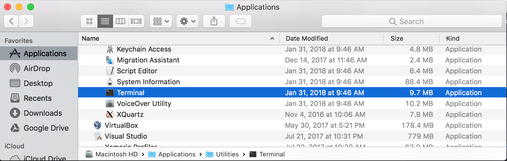

#  Building Anoncoin for OSX

[Home](../README.md) |
**Installation** |
[Developers](./doc/DEVELOPER.md) |
[Project](https://github.com/Anoncoin/anoncoin/projects/1) |
Roadmap |
Wallet |
Mining

**OSX** |
[Windows](./BUILD_WINDOWS.md) |
[Unix](.BUILD_UNIX.md)

## Preparation

#### Terminal
Open the Terminal application from the Utilities folder of the Applications directory:



#### XCode
Ensure the OSX command line tools are installed:

    xcode-select --install

When the popup appears, click `Install`.

#### Homebrew

Install [Homebrew](https://brew.sh) by running the following command:

```bash
/usr/bin/ruby -e "$(curl -fsSL https://raw.githubusercontent.com/Homebrew/install/master/install)"
```

## Dependencies

Use Homebrew to install the dependencies on your machine:

```bash
brew install automake berkeley-db4 libtool boost miniupnpc openssl pkg-config protobuf python3 qt libevent librsvg
```

*NOTE: Building with Qt5 is recommended*

Due to the default C++ compiler changing in new versions of OSX, you will likely need to reinstall Boost from source:

```bash
brew uninstall boost
brew install --build-from-source --HEAD boost
```


## Obtain Source Code

Clone the Anoncoin source code and cd into `anoncoin`

```bash
git clone git@github.com:Anoncoin/anoncoin.git
cd anoncoin
```

## Install Berkeley DB

It is recommended to use Berkeley DB 4.8. To build it yourself:

```bash
./contrib/install_db4.sh .
```

*NOTE: You only need Berkeley DB if the wallet is enabled (see the section `--disable-wallet-mode` below)*


## Build Anoncoin Core

Configure and build the headless Anoncoin binaries as well as the GUI:

#### Set Flags

In order for Anoncoin to find the correct OpenSSL and BDB lib, some flags must be set before compiling:

```bash
export LDFLAGS=-L/usr/local/opt/openssl/lib
export CPPFLAGS=-I/usr/local/opt/openssl/include
export BDB_PREFIX="$(pwd)/db4"
```

Note the update to configure if you have Berkeley DB installed:

```bash
./autogen.sh
./configure --with-qt-incdir=/usr/local/opt/qt/include --with-qt-libdir=/usr/local/opt/qt/lib BDB_LIBS="-L${BDB_PREFIX}/lib -ldb_cxx-4.8" BDB_CFLAGS="-I${BDB_PREFIX}/include"
make
```

*NOTE: You can disable the GUI build by passing `--without-gui` to configure.*


It is recommended to build and run the unit tests:

```bash
make check
```

## App bundle

You can also create a .dmg that contains the .app bundle (optional):

```bash
make deploy
```

## Running Anoncoin Core

#### RPC Config

Before running, it's recommended you create an RPC configuration file

```bash
echo -e "rpcuser=anoncoinrpc\nrpcpassword=$(xxd -l 16 -p /dev/urandom)" > "/Users/${USER}/Library/Application Support/Anoncoin/anoncoin.conf"
chmod 600 "/Users/${USER}/Library/Application Support/Anoncoin/anoncoin.conf"
```

#### Bootstrap

The first time you run anoncoind, it will start downloading the blockchain. This process could take several hours.  To speed up the process, you can download a bootstrap file.

From your browser, download the `bootstrap.dat` file from [mega.nz](https://mega.nz/#!IqACmRhL!2Ti8rUlsnWoD4d5q3boMHQwaEbbqmxZqYq6FmWevVxI) or use [Bittorrent](./BOOTSTRAP.md).

Move the Bootstrap file to Data Directory:

```
mv ~/Downloads/bootstrap.dat "${HOME}/Library/Application Support/Anoncoin"
```

*Note: this is safe - the `bootstrap.dat` file will be verified on the blockchain*


Anoncoin Core is now available at `./src/anoncoind`


You can monitor the download process by looking at the debug.log file:

    tail -f $HOME/Library/Application\ Support/Anoncoin/debug.log

Other commands:
-------

    ./src/anoncoind -daemon # Starts the anoncoin daemon.
    ./src/anoncoin-cli --help # Outputs a list of command-line options.
    ./src/anoncoin-cli help # Outputs a list of RPC commands when the daemon is running.

Notes
-----

* Tested on OS X 10.8 through 10.13 on 64-bit Intel processors only.

* Building with downloaded Qt binaries is not officially supported. See the notes in [#7714](https://github.com/bitcoin/bitcoin/issues/7714)


Making a deterministic OSX dmg disk image.
==========================================

Working OSX DMG's are created in Linux by combining a recent clang,
the Apple's binutils (ld, ar, etc), and DMG authoring tools.

Apple uses clang extensively for development and has upstreamed the necessary
functionality so that a vanilla clang can take advantage. It supports the use
of -F, -target, -mmacosx-version-min, and --sysroot, which are all necessary
when building for OSX. A pre-compiled version of 3.2 is used because it was not
available in the Precise repositories at the time this work was started. In the
future, it can be switched to use system packages instead.

Apple's version of binutils (called cctools) contains lots of functionality
missing in the FSF's binutils. In addition to extra linker options for
frameworks and sysroots, several other tools are needed as well such as
install_name_tool, lipo, and nmedit. These do not build under linux, so they
have been patched to do so. The work here was used as a starting point:
https://github.com/mingwandroid/toolchain4

In order to build a working toolchain, the following source packages are needed
from Apple: cctools, dyld, and ld64.

Beware. This part is ugly. Very very very ugly. In the future, this should be
broken out into a new repository and cleaned up. Additionally, the binaries
only work when built as x86 and not x86_64. This is an especially nasty
limitation because it must be linked with the toolchain's libLTO.so, meaning
that the entire toolchain must be x86. Gitian x86_64 should not be used until
this has been fixed, because it would mean that several native dependencies
(openssl, libuuid, etc) would need to be built as x86 first.

These tools inject timestamps by default, which produce non-deterministic
binaries. The ZERO_AR_DATE environment variable is used to disable that.

This version of cctools has been patched to use the current version of clang's
headers and and its libLTO.so rather than those from llvmgcc, as it was
originally done in toolchain4.

To complicate things further, all builds must target an Apple SDK. These SDKs
are free to download, but not redistributable.
To obtain it, register for a developer account, then download xcode4630916281a.dmg:
https://developer.apple.com/downloads/download.action?path=Developer_Tools/xcode_4.6.3/xcode4630916281a.dmg
This file is several gigabytes in size, but only a single directory inside is
needed: Xcode.app/Contents/Developer/Platforms/MacOSX.platform/Developer/SDKs/MacOSX10.7.sdk

Unfortunately, the usual linux tools (7zip, hpmount, loopback mount) are incapable of opening this file.
To create a tarball suitable for gitian input, mount the dmg in OSX, then create it with:
  $ tar -C /Volumes/Xcode/Xcode.app/Contents/Developer/Platforms/MacOSX.platform/Developer/SDKs/ -czf MacOSX10.7.sdk.tar.gz MacOSX10.7.sdk


The gitian descriptors build 2 sets of files: Linux tools, then Apple binaries
which are created using these tools. The build process has been designed to
avoid including the SDK's files in Gitian's outputs. All interim tarballs are
fully deterministic and may be freely redistributed.

genisoimage is used to create the initial DMG. It is not deterministic as-is,
so it has been patched. A system genisoimage will work fine, but it will not
be deterministic because the file-order will change between invocations.
The patch can be seen here:
https://raw.githubusercontent.com/theuni/osx-cross-depends/master/patches/cdrtools/genisoimage.diff
No effort was made to fix this cleanly, so it likely leaks memory badly. But
it's only used for a single invocation, so that's no real concern.

genisoimage cannot compress DMGs, so afterwards, the 'dmg' tool from the
libdmg-hfsplus project is used to compress it. There are several bugs in this
tool and its maintainer has seemingly abandoned the project. It has been forked
and is available (with fixes) here: https://github.com/theuni/libdmg-hfsplus .

The 'dmg' tool has the ability to create DMG's from scratch as well, but this
functionality is broken. Only the compression feature is currently used.
Ideally, the creation could be fixed and genisoimage would no longer be necessary.

Background images and other features can be added to DMG files by inserting a
.DS_Store before creation. The easiest way to create this file is to build a
DMG without one, move it to a device running OSX, customize the layout, then
grab the .DS_Store file for later use. That is the approach taken here.
